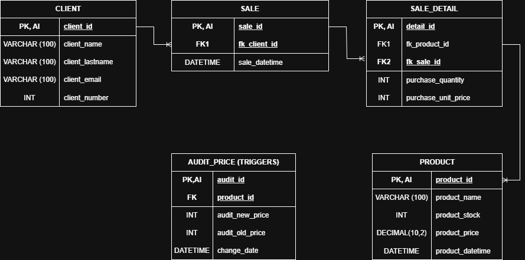

## 🧑‍💻 Project TechZone

## 🎯 Project Objective

Build a complete (end-to-end) data pipeline to demonstrate technical skills in the modern data stack.
The "TechZone" project seeks to resolve the fragmentation of commercial information by:

- **ETL (Extract, Transform, Load):** Using **Python (Pandas)** to clean and normalize messy datasets.
- **Data Modeling:** Designing an efficient relational schema in **SQL** for fast queries.
- **Reporting:** Creation of an interactive dashboard in **Power BI** that allows stakeholders to view key metrics (Total Sales, Profit Margin, Top Products) in real time.

## 🛠️ Tools & Technologies

## 🗄️ Database Design

### Initial Diagram
The tables and their respective attributes were developed in the first stage:

  

### Final Diagram
*This section will be updated with the final version of the relational model after the optimization phase.*

  

