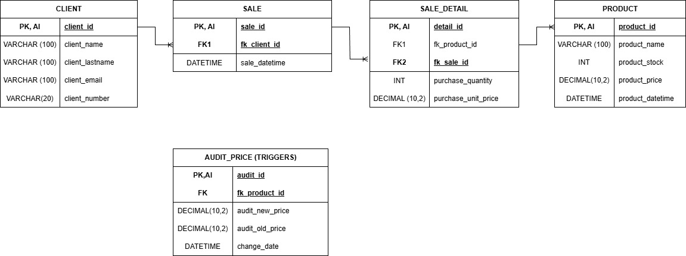

# 🧑‍💻 Project TechZone: End-to-End Data Engineering Pipeline

## 🎯 Project Objective
**TechZone** is a comprehensive data management project designed to simulate a real-world retail environment. The goal is to build a complete data pipeline demonstrating proficiency in the **Modern Data Stack**, resolving information fragmentation through automation and structured design.

Key pillars of the project:
- **ETL (Extract, Transform, Load):** Developed Python scripts using **Pandas** and **SQLAlchemy** to clean, normalize, and load raw CSV data into a relational database.
- **Data Modeling:** Designed a robust **3NF (Third Normal Form)** SQL schema to ensure data integrity and query performance.
- **Automation & Security:** Implemented robust error handling, secure credential management, and automated auditing triggers.
- **Synthetic Data Generation:** Engineered complex SQL Stored Procedures to simulate realistic sales history.
- **Reporting & Visualization:** Interactive **Power BI** dashboard for real-time metrics (Sales, Margins, Top Products).

## 🛠️ Tools & Technologies
 
 
 
 


## 📂 Project Architecture
The project is organized to separate raw data, logic, visualization, and database definitions:

```text
📂 TechZone
├── 📁 dashboard        # Power BI (.pbix) source file and screenshots
├── 📁 data_raw         # Raw data sources (CSV/Excel)
├── 📁 etl_scripts      # Python scripts for ETL automation (Pandas/SQLAlchemy)
├── 📁 sql_db           # SQL scripts (DDL, Triggers, Stored Procedures)
└── 📄 README.md        # Project documentation
```
## ⚡ Key Features Implemented

### 1. Database Engineering (SQL)
* **Schema Design:** Created tables for `CLIENT`, `PRODUCT`, `SALE`, and `SALE_DETAIL` enforcing relational integrity (Foreign Keys).
* **Audit System:** Dedicated `AUDIT_PRICE` table to track historical price changes automatically.
* **Data Types:** Strict use of `DECIMAL(10,2)` for financial precision and `DATETIME` for temporal tracking.

### 2. Python ETL Pipeline
* **Dynamic Path Handling:** Utilized `os` module to ensure the script runs on any operating system without path errors.
* **Secure Connections:** Implemented `urllib.parse.quote_plus` to safely handle complex database passwords with special characters.
* **Data Transformation:** Automated generation of timestamps and data type validation before loading to MySQL.
* **Idempotency:** The script uses `if_exists='append'` logic to manage safe data ingestion.

### 3. Sales Simulation Engine (Stored Procedure)
* **Synthetic Data Generation:** Engineered custom SQL Stored Procedure (`simulate_sales`) to generate realistic transaction history.
* **Smart Logic:** The algorithm randomly selects *existing* Clients and Products to ensure referential integrity, preventing foreign key errors.

## 📊 Business Intelligence & Analytics
The project culminates in a Power BI Dashboard connected directly to the MySQL database via a Star Schema model. This layer transforms raw transactional data into actionable insights.

### Key Metrics & Visualizations:

1. Total Revenue (KPI Card):
    * Metric: Calculated dynamically using DAX (SUMX of Quantity * Unit Price).
    * Purpose: Provides an immediate view of the total financial performance of the store.
2. Revenue by Client (Bar Chart):
    * Metric: Total Revenue aggregated by client_name.
    * Purpose: Identifies "VIP Clients" and analyzes customer spending behavior to drive loyalty strategies.
3. Sales Distribution by Product (Donut Chart):
    * Metric: Count of units sold (purchase_quantity) per product_name.
    * Purpose: Visualizes the most popular items in the inventory, aiding in stock management decisions.


Note: The .pbix source file is available in the dashboard/ folder.

## 🗄️ Database Design
Logic & Schema
The database follows a relational model optimized for retail transactions:

* Independent Tables: CLIENT, PRODUCT (Master Data).

* Transactional Tables: SALE (Header), SALE_DETAIL (Lines).

* Triggers: Automated mechanisms to capture price updates (Completed).

Schema Diagram
<div align="center">

</div>

(Note: The diagram represents the conceptual model. The physical implementation in MySQL includes additional audit tables.)

## 🚀 How to Run locally
1. Clone the repository: <br>
  ```git clone [https://github.com/IvanRavarotto/TechZone.git](https://github.com/IvanRavarotto/TechZone.git)```
2. Database Setup:
     * Execute sql_db/01_create_tables.sql in MySQL Workbench to create the schema.
     * Execute sql_db/02_triggers.sql to activate the audit system.
     * Execute sql_db/03_stored_procedures.sql to install the sales simulator.
3. Python Environment:
    ```
    # Create virtual env
    python -m venv .venv
    source .venv/bin/activate  # or .\.venv\Scripts\Activate in Windows

    ### Install dependencies
    pip install pandas sqlalchemy mysql-connector-python
    ```
4. Run ETL:
    ```python etl_scripts/load_products.py```
5. Generate Data (simulate sales):
   * In MySQL Workbench, run:
    ```CALL simulate_sales(100); -- Generates 100 random transactions```
6. View Dashboard:
   * Open dashboard/TechZone_Dashboard.pbix in Power BI Desktop.

Author: Ivan Ravarotto